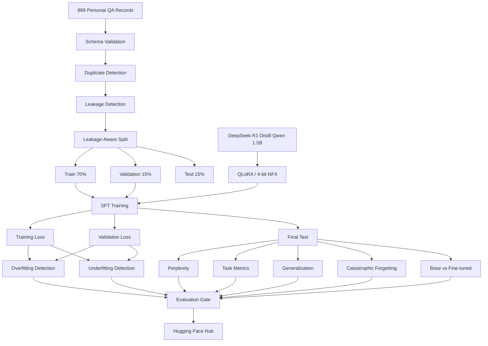

# llm-personal-finetuning

A reproducible, **$0-cost** pipeline that fine-tunes
[`deepseek-ai/DeepSeek-R1-Distill-Qwen-1.5B`](https://huggingface.co/deepseek-ai/DeepSeek-R1-Distill-Qwen-1.5B)
with **QLoRA** on a personal-profile QA dataset — and then does the harder part:
honestly measuring whether the fine-tune actually helped.

Training runs on Kaggle's free GPU. Validation and tests run on GitHub Actions
(CPU only). The adapter is distributed via the Hugging Face Hub. No paid API, no
cloud provider, no managed tracking service.

[](https://github.com/Harikrishnan200/deepseek-finetuning/actions/workflows/validate.yml)

---

## Table of contents

1. [Project overview](#1-project-overview)
2. [Why fine-tune?](#2-why-fine-tune)
3. [Why QLoRA?](#3-why-qlora)
4. [Architecture](#4-architecture)
5. [Dataset format](#5-dataset-format)
6. [Dataset splitting](#6-dataset-splitting)
7. [Leakage prevention](#7-leakage-prevention)
8. [Training](#8-training)
9. [Validation](#9-validation)
10. [Overfitting detection](#10-overfitting-detection)
11. [Underfitting detection](#11-underfitting-detection)
12. [Perplexity](#12-perplexity)
13. [Task-specific metrics](#13-task-specific-metrics)
14. [Generalization](#14-generalization)
15. [Catastrophic forgetting](#15-catastrophic-forgetting)
16. [Base vs fine-tuned comparison](#16-base-vs-fine-tuned-comparison)
17. [Evaluation gates](#17-evaluation-gates)
18. [Kaggle setup](#18-kaggle-setup)
19. [Hugging Face setup](#19-hugging-face-setup)
20. [GitHub Actions](#20-github-actions)
21. [FastAPI](#21-fastapi)
22. [Locust](#22-locust)
23. [Privacy and security](#23-privacy-and-security)
24. [Project limitations](#24-project-limitations)
25. [Future improvements](#25-future-improvements)

---

## 1. Project overview

The dataset is ~889 instruction/response pairs about one person — education,
projects, technical skills, career, hobbies, background. The goal is **not** a
generally intelligent model. It is a focused investigation:

> Can QLoRA fine-tuning make a 1.5B distilled model better at answering questions
> about a specific personal profile, without wrecking its general behaviour?

Answering that honestly requires more than a training loop. The bulk of this
repository is the measurement apparatus:

- a leakage-aware splitter, so the test set measures generalization rather than recall;
- a curated set of **reworded** questions, so "learned the fact" is separable from
  "memorised the question string";
- a general-capability probe, so catastrophic forgetting is visible;
- a promotion gate that returns `PASS` / `PASS_WITH_WARNINGS` / `FAIL` from a config
  file rather than from vibes.

### Project tree

```
llm-personal-finetuning/
├── configs/
│   ├── qlora.yaml                  # baseline training config
│   ├── evaluation.yaml             # metric thresholds + promotion gate
│   └── experiments/                # exp_a_r8 / exp_b_r16 / exp_c_r32
├── data/
│   ├── raw/personal_dataset.jsonl  # your data              (private by default)
│   ├── processed/{train,validation,test}.jsonl  #           (private by default)
│   ├── eval/
│   │   ├── generalization.jsonl    # 45 reworded questions  (private by default)
│   │   └── general_knowledge.jsonl # 36 general probes      (committed - no personal data)
│   └── reports/                    # dataset / duplicate / leakage reports
├── src/
│   ├── data/       schema, validate, deduplicate, leakage, split, prepare
│   ├── training/   config, model, trainer
│   ├── evaluation/ metrics, overfitting, generalization, forgetting, evaluate, plots, report
│   ├── inference/  generate
│   ├── api.py      FastAPI service
│   └── publish.py  Hugging Face Hub upload
├── scripts/        validate_dataset, prepare_dataset, split_dataset, train_qlora,
│                   evaluate, compare_models, generate, push_to_hub
├── notebooks/kaggle_train.ipynb
├── tests/          test_schema, test_split, test_config, test_evaluation
├── performance/locustfile.py
├── artifacts/      training/, evaluation/, experiments/, reports/
└── .github/workflows/{validate,release}.yml
```

### Design rule: the CPU/GPU boundary

`src/data/`, `src/evaluation/metrics.py`, `overfitting.py`, `report.py`,
`generalization.py`, `forgetting.py` and `src/training/config.py` **do not import
torch**. That is what lets the whole test suite, the metrics, the heuristics and
the promotion gate run in CI on a free CPU runner. Everything torch-dependent is
confined to `src/training/model.py`, `trainer.py`, `src/evaluation/evaluate.py`
and `src/inference/`.

Correspondingly there are two requirement files:

| File | Contents | Used by |
| --- | --- | --- |
| `requirements-dev.txt` | numpy, sklearn, matplotlib, pyyaml, fastapi, pytest, ruff, locust | local dev, CI |
| `requirements.txt` | the above **plus** torch, transformers, peft, trl, bitsandbytes | Kaggle / any CUDA box |

---

## 2. Why fine-tune?

The alternatives were considered and rejected for this specific goal:

- **Prompting alone** — the base model has no knowledge of a private individual, so
  it hallucinates. Nothing in the prompt fixes that.
- **RAG** — would work, and for a production assistant it is usually the better
  answer. But it tests a retriever, not the model, and the question here is
  explicitly about parameter-efficient fine-tuning behaviour.
- **Full fine-tuning** — 1.5B parameters in fp16 needs roughly 24 GB for weights
  plus optimizer state and gradients. It does not fit on Kaggle's free 16 GB T4.

Fine-tuning also makes the failure modes this project is designed to measure —
overfitting on 622 examples, catastrophic forgetting, memorising question strings
instead of facts — actually observable.

## 3. Why QLoRA?

QLoRA = 4-bit quantized frozen base model + trainable low-rank adapters.

- The base weights are stored in **4-bit NF4** (a normal-float format matched to the
  roughly-Gaussian distribution of neural network weights) with **double
  quantization** (the quantization constants are themselves quantized), cutting
  ~3.5 GB of fp16 weights to well under 1.5 GB.
- Only the LoRA matrices receive gradients — around **1%** of total parameters. Optimizer
  state is tiny in proportion.
- The result fits comfortably on a free T4 with room for activations and a KV cache.
- The output is a ~40 MB adapter rather than a multi-gigabyte checkpoint, which is
  what makes per-experiment versioning practical.

## 4. Architecture



## 5. Dataset format

JSONL, one object per line:

```json
{"instruction": "What is Harikrishnan's full name?", "response": "His name is N Harikrishnan."}
```

### Putting your dataset in the repository

```bash
cp /path/to/your-dataset.jsonl data/raw/personal_dataset.jsonl
python scripts/validate_dataset.py --strict
```

`data/raw/*.jsonl` is **gitignored by default**, as are the processed splits and the
generalization set — see [Privacy](#23-privacy-and-security). For Kaggle, upload the
raw file as a *private* Kaggle Dataset and attach it to the notebook.

The validator rejects, with the line number and reason: invalid JSON, non-object
lines, missing `instruction`/`response`, non-string values, empty-after-strip
values, and unexpected extra fields. Rejected content is **never** echoed into a
report — only the line number and the category of failure.

`scripts/validate_dataset.py` writes `data/reports/dataset_report.json` and a
human-readable `dataset_report.md` containing counts, duplicate counts, a
SHA-256 of the dataset content, and min/max/mean/median/p95 length statistics in
both characters and words.

## 6. Dataset splitting

70% train / 15% validation / 15% test, seed `42`, configured in `configs/qlora.yaml`.

The critical detail: **groups are split, not records.**

1. Normalize every instruction (lowercase, strip accents and punctuation, collapse whitespace).
2. Union exact duplicate `(instruction, response)` pairs.
3. Union exact duplicate instructions.
4. Union near-duplicate instructions above `near_duplicate_threshold` (default `0.90`),
   using TF-IDF over character 3–5 grams with cosine similarity — local, free, no
   embedding API.
5. Take the transitive closure with union-find. Each connected component is one group.
6. Sort groups largest-first, shuffle within equal-size bands using the seed, then assign
   each group to whichever split is furthest below its target count.

Greedy largest-first assignment matters: a 16-record group dropped into the test
set would blow a 133-record quota by 12%. Filling the largest deficit each time
keeps the ratios tight.

On the reference dataset:

| | Records | Ratio |
| --- | --- | --- |
| train | 622 | 0.6997 |
| validation | 134 | 0.1507 |
| test | 133 | 0.1496 |
| **total** | **889** | 713 groups, largest 16 |

```bash
python scripts/prepare_dataset.py --config configs/qlora.yaml --fail-on-leakage
```

Splitting is deterministic: same input + same seed + same threshold ⇒ byte-identical
splits. There is a test for this.

## 7. Leakage prevention

Detection happens twice, and it **reports** rather than silently deleting.

**Before splitting** (`data/reports/duplicate_report.json`): exact duplicate pairs,
exact duplicate instructions, and near-duplicate instruction/response pairs with
similarity scores. Nothing is dropped — you decide.

**After splitting** (`data/reports/leakage_report.json`, and again at final
evaluation as `artifacts/evaluation/final_leakage_report.json`):

- exact overlaps: a normalized held-out instruction that also appears in train;
- near overlaps: a held-out instruction with a training instruction above threshold;
- shared group ids (must be empty by construction);
- per-split overlap rate and an overall `leakage_free` flag.

### One subtlety worth knowing

TF-IDF similarity depends on the corpus the IDF weights are fitted on. Fitting the
leakage detector on just `train + test` produced *different* scores than the
grouping pass, which fits on all 889 records — enough to push a borderline pair
(0.892 globally) above 0.90 locally and report phantom leakage. Both stages now fit
on the **full corpus** (`cross_similarity(..., corpus=...)`), so they agree by
construction. The reference dataset reports `max_overlap_rate: 0.0`.

## 8. Training

```bash
# validate the config without a GPU
python scripts/train_qlora.py --config configs/qlora.yaml --dry-run

# the real thing (needs CUDA)
python scripts/train_qlora.py --config configs/qlora.yaml
```

### Prompt format

Configurable in `configs/qlora.yaml`; no system prompt is imposed:

```
### Instruction:
{instruction}

### Response:
{response}
```

With `train_on_completion_only: true` (the default), every token up to and including
`### Response:\n` is masked to `-100`, so the loss is computed on the **answer only**.
The instructions in this dataset are templated and repetitive; training on them
would largely teach the model to reproduce question phrasing.

### LoRA target modules are discovered, not assumed

The base model is a `Qwen2ForCausalLM` — 28 layers, hidden size 1536, 12 attention
heads with 2 KV heads (GQA). Rather than copying module names from a tutorial,
`src/training/model.py:find_target_modules` walks the **loaded** module tree, finds
every `nn.Linear`/`Linear4bit` leaf whose name matches a known projection
(`q_proj`, `k_proj`, `v_proj`, `o_proj`, `gate_proj`, `up_proj`, `down_proj`), and
raises a clear error listing the actual leaf names if it finds none. `lm_head` is
excluded — adapting a 151936-row output projection would dominate adapter size for
no benefit. Set `lora.target_modules` in the config to override.

### Quantization

`bnb_4bit_quant_type: nf4`, `bnb_4bit_use_double_quant: true`, and a compute dtype
of `auto` — bfloat16 when `torch.cuda.is_bf16_supported()`, otherwise float16.
Kaggle's **T4 does not support bf16** and falls back to fp16 automatically.

### API-drift resistance

TRL's `SFTTrainer` argument names have churned across releases. Instead of hoping,
this pipeline tokenizes and label-masks the dataset itself, passes it in
pre-tokenized (`dataset_kwargs={"skip_prepare_dataset": True}`) with its own
padding collator, and builds `SFTConfig` by filtering the desired settings against
the signature *actually installed* — printing anything it had to drop. A newer or
older TRL degrades gracefully instead of crashing.

### Outputs

| Path | Contents |
| --- | --- |
| `artifacts/training/adapter/` | LoRA weights + tokenizer |
| `artifacts/training/checkpoints/` | best-2 checkpoints by `eval_loss` |
| `artifacts/training/training_history.json` | step, epoch, train loss, val loss, LR |
| `artifacts/training/loss_curve.png` | training vs validation loss |
| `artifacts/training/run_metadata.json` | full reproducibility record |

`run_metadata.json` records the git commit SHA, per-split dataset SHA-256 hashes,
model name, seed, full training/LoRA/quantization/prompt config, resolved target
modules, parameter counts, effective batch size, resolved compute dtype, GPU name,
Python version, platform, and the version of every relevant library.

## 9. Validation

The validation split drives evaluation during training (`eval_strategy: steps`,
`eval_steps: 50`), checkpoint selection (`metric_for_best_model: eval_loss`,
`load_best_model_at_end: true`), and the overfitting/underfitting heuristics.

**The test split is never touched during training.** It is loaded for the first time
by `src/evaluation/evaluate.py`, after training has finished.

## 10. Overfitting detection

`analyse_overfitting` combines three signals from the loss curves:

1. **Generalization gap** = final validation loss − final training loss.
2. **Validation rise ratio** = how far final validation loss sits above its best value.
3. **Divergence** — validation rising over the last half of training while training loss falls.

| Verdict | Condition |
| --- | --- |
| `strong_overfitting` | gap ≥ `strong_overfitting_gap` (0.80), **or** rise ratio ≥ 0.10 with validation rising and training falling |
| `possible_overfitting` | gap ≥ `possible_overfitting_gap` (0.30), or validation ended above its best |
| `healthy` | neither |
| `insufficient_data` | fewer than two evaluation points |

Thresholds live in `configs/evaluation.yaml`. Output:
`artifacts/evaluation/overfitting_report.json`, including `best_step`,
`best_validation_loss`, and every raw signal so the classification can be
second-guessed.

With 622 training examples and 5 epochs this is a live risk, not a theoretical one.

## 11. Underfitting detection

**This is a heuristic and is documented as such in the code, the report, and here.**
It flags a run when the final training loss is high (≥ `high_loss_threshold`) *and*
at least one of: validation loss also high, train/validation gap unusually small,
or relative loss improvement from the first logged step below
`min_relative_loss_improvement`.

It cannot distinguish "the model has not learned" from "this dataset is
intrinsically hard", and it will occasionally flag a run that is fine. Read it
alongside the base-vs-fine-tuned comparison, which is grounded in actual
capability, before acting on it. Output:
`artifacts/evaluation/underfitting_report.json`.

## 12. Perplexity

Computed on **train, validation, and test**, for **both** the base and fine-tuned
models — `artifacts/evaluation/perplexity.json`.

Two details that make the numbers trustworthy:

- Loss is computed on **response tokens only**, using exactly the same label mask as
  training. Including the templated prompt would drag every number toward the
  perplexity of boilerplate.
- Losses are **token-weighted**, summed over tokens and divided once at the end, so
  the result does not depend on how records happened to be batched.

Perplexity alone is not sufficient here — a model can lower perplexity by learning
the answer *style* without learning any fact — which is why sections 13–15 exist.

## 13. Task-specific metrics

All local, deterministic, and free. No LLM judge.

| Metric | What it measures |
| --- | --- |
| `exact_match` | strict string equality |
| `normalized_exact_match` | equality after lowercase / punctuation / article / whitespace normalization — **the headline task metric** |
| `token_f1` | bag-of-tokens F1; partial credit when the answer is right but verbose |
| `contains_reference` | whole-token substring match; used for short gold answers |

Normalization is SQuAD-style: `"The  N. Harikrishnan!"` → `"n harikrishnan"`.

A large gap between exact match and F1 usually means the model is correct but
phrasing differently from the reference — worth reading both.

## 14. Generalization

`data/eval/generalization.jsonl` — 45 hand-written questions that ask about facts
present in the **training** split, phrased differently:

| Training | Generalization |
| --- | --- |
| "What is Harikrishnan's full name?" | "Can you tell me his complete name?" |
| "What is his father's name?" | "Who fathered him?" |
| "When did Harikrishnan onboard at Zero Pixels?" | "On which date did he report for duty at his company?" |

This set is **audited**: `audit_generalization_set` checks every item against every
training question and fails if any exceeds the similarity threshold. Building this
set, three items initially scored above 0.90 against training questions and were
rewritten — they would have measured memorisation. The set now peaks at 0.875 with
a mean of 0.52, and a test enforces this on every CI run.

Primary metric here is **token F1**, because the references are short atomic facts
while models answer in sentences. Output: `artifacts/evaluation/generalization.json`.

## 15. Catastrophic forgetting

`data/eval/general_knowledge.jsonl` — 36 general-purpose questions containing **no
personal information**, across five categories: basic maths, simple reasoning,
common factual knowledge, Python, and general CS.

`forgetting = base_score − fine_tuned_score` on `contains_reference` (gold answers
are short: "43", "Paris", "def"). Positive means capability was lost. The report
breaks this down per category, so a model that kept its Python but lost its
arithmetic is visible as exactly that.

This is a **smoke test, not a benchmark**. 36 items cannot certify that general
ability is intact; a large drop is strong evidence that it is not. The code and the
report both say so. Output: `artifacts/evaluation/forgetting_report.json`.

## 16. Base vs fine-tuned comparison

Every number is produced for both models on **identical inputs with identical
greedy decoding** (`do_sample=False`, `num_beams=1`), so differences are
attributable to the adapter and not to the harness.

```bash
python scripts/evaluate.py --config configs/qlora.yaml \
    --adapter-path artifacts/training/adapter
```

The models are loaded **one at a time** — a 16 GB T4 will not hold two copies plus
generation KV cache. Each model's answers are cached before it is evicted, then the
comparisons run over the cached text.

For qualitative inspection:

```bash
python scripts/compare_models.py --from-split data/processed/test.jsonl --limit 10
```

Output: `artifacts/evaluation/base_vs_finetuned.json` plus six labelled plots in
`artifacts/evaluation/plots/`.

## 17. Evaluation gates

`configs/evaluation.yaml`:

```yaml
gate:
  minimum_task_accuracy_improvement: 0.05   # fine-tuned - base, normalized EM on test
  minimum_generalization_improvement: 0.02  # fine-tuned - base, token F1
  maximum_allowed_forgetting: 0.10          # base - fine-tuned, general knowledge
  maximum_test_perplexity: 25.0
  maximum_leakage_rate: 0.0
  allow_overfitting: false
```

| Verdict | Meaning |
| --- | --- |
| `PASS` | every hard requirement met, no warnings — safe to promote |
| `PASS_WITH_WARNINGS` | nothing hard failed, but something needs a human look |
| `FAIL` | at least one hard requirement failed — do not promote |

A **missing** measurement becomes a warning, never a silent pass; if nothing at all
could be evaluated the verdict is `FAIL`. Output: `artifacts/evaluation/gate.json`,
and the `## Final Recommendation` section of `final_report.md` with a per-check table.

### Interpreting `final_report.md`

Read it in this order:

1. **Leakage** — if `max_overlap_rate > 0`, nothing below it is trustworthy. Stop and fix the split.
2. **Training Behavior** — `strong_overfitting` means the model memorised; reduce epochs or LoRA rank.
3. **Task Performance** — the headline. `normalized_exact_match` improvement is what the fine-tune bought you.
4. **Generalization** — if task performance improved but this did not, the model memorised question strings rather than facts. This is the most common failure mode for this kind of dataset.
5. **Catastrophic Forgetting** — the cost side of the ledger. Weigh it against 3 and 4.
6. **Perplexity** — supporting evidence. Falling perplexity with flat task metrics means it learned style, not facts.
7. **Final Recommendation** — the gate's verdict and per-check table.

## 18. Kaggle setup

1. Push this repo to GitHub.
2. New Kaggle notebook → **Settings → Accelerator → GPU T4 x2** (or P100).
3. **Settings → Internet → On**.
4. Upload `personal_dataset.jsonl` as a **private** Kaggle Dataset, attach it.
5. *(Optional, for publishing)* **Add-ons → Secrets → HF_TOKEN**.
6. Open `notebooks/kaggle_train.ipynb`, set `REPO_URL` and `HUB_MODEL_ID`, Run All.

The notebook installs deps, asserts CUDA and prints GPU name / total / free memory
and bf16 support, clones the repo, validates the dataset, runs duplicate and
leakage detection, splits, inspects the model architecture, trains, plots curves,
runs full evaluation, renders the report, and publishes **only if the gate says
`PASS`**.

Expect ~25–45 minutes for 5 epochs on ~620 examples on a T4.

### Running experiments

Free GPU quota is roughly 30 hours/week, so **do not sweep**. Run one at a time:

```bash
python scripts/train_qlora.py --config configs/experiments/exp_a_r8.yaml   # r=8,  lr=2e-4, 3 epochs
python scripts/train_qlora.py --config configs/experiments/exp_b_r16.yaml  # r=16, lr=2e-4, 3 epochs
python scripts/train_qlora.py --config configs/experiments/exp_c_r32.yaml  # r=32, lr=1e-4, 5 epochs
```

Each writes to its own `artifacts/experiments/<run_name>/` — a test enforces that
experiment configs never share an output directory with the baseline. Start with
A: if it underfits, move up in rank; if it overfits, cut epochs before cutting rank.

## 19. Hugging Face setup

```bash
export HF_TOKEN=hf_...   # write-scoped token from https://huggingface.co/settings/tokens

python scripts/push_to_hub.py \
    --config configs/qlora.yaml \
    --adapter-path artifacts/training/adapter \
    --hub-model-id Harikrishnan200/deepseek-personal-qlora \
    --require-pass
```

Or during training: `python scripts/train_qlora.py --config configs/qlora.yaml
--push-to-hub --hub-model-id Harikrishnan200/deepseek-personal-qlora`.

Uploaded: adapter weights, tokenizer, a generated model card (base model, LoRA
config, parameter counts, prompt format, evaluation summary, gate verdict, usage
snippet, and an explicit limitations section), and the **aggregate** evaluation
reports and plots under `evaluation/`.

Never uploaded: `data/raw/`, `data/processed/`, or `test_predictions.json`. The
uploader hard-blocks those filenames regardless of what it is pointed at.

Repos default to **private** (`--public` to opt out). `--require-pass` refuses to
publish anything the gate did not mark `PASS`.

## 20. GitHub Actions

`.github/workflows/validate.yml` — on every push and PR, CPU only:

ruff → pytest with coverage → config validation across `configs/**` → evaluation
dataset schema validation → personal dataset schema validation → duplicate and
leakage checks with `--fail-on-leakage` → a secret scan across all tracked files
→ an assertion that **torch is not installed**, proving no GPU work was attempted.

Steps that need the personal dataset skip cleanly with exit 0 when it is not
committed, so CI is green on a fresh clone. That is the intended state: on a public
repo, CI exercises the code, the configs, the metrics, the heuristics and the gate,
while your data stays on your machine. No Hugging Face token is required.

`.github/workflows/release.yml` — on `v*` tags, packages configs, dataset reports,
evaluation reports and plots into a release tarball. Weights go to the Hub, not
GitHub; the dataset goes nowhere.

## 21. FastAPI

```bash
uvicorn src.api:app --host 0.0.0.0 --port 8000
```

| Endpoint | Behaviour |
| --- | --- |
| `GET /health` | liveness, model id, adapter path, whether the model is loaded, last load error |
| `POST /generate` | `{"prompt": "..."}` → `{"response", "latency_seconds", "generated_tokens", "tokens_per_second"}` |

```bash
curl -s localhost:8000/generate -H 'content-type: application/json' \
     -d '{"prompt": "What is Harikrishnan'\''s full name?"}'
```

Configured entirely by environment variables (`MODEL_NAME`, `ADAPTER_PATH`,
`CONFIG_PATH`) — no paths or secrets in code. The model loads lazily on first
`/generate` behind a lock, so `/health` responds immediately and startup is fast.
No auth and no database, deliberately.

The service exposes **generated answers only**. It never reads or serves
`data/raw/`, `data/processed/`, or stored predictions.

## 22. Locust

Serving performance, kept deliberately separate from model quality:

```bash
uvicorn src.api:app --port 8000                                    # terminal 1
locust -f performance/locustfile.py --host http://localhost:8000   # terminal 2

# headless
locust -f performance/locustfile.py --host http://localhost:8000 \
    --headless --users 5 --spawn-rate 1 --run-time 1m
```

Reports latency percentiles, requests/sec, and error rate. 90% of requests hit
`/generate`, 10% hit `/health`. Prompts in the load test are generic — no personal
data is embedded. This never runs in CI and never needs a GPU runner.

## 23. Privacy and security

The dataset describes a real person. Accordingly:

- **Everything derived from your dataset is gitignored by default**, because a
  rearrangement of personal data is still personal data:

  | Path | Default | Why |
  | --- | --- | --- |
  | `data/raw/*.jsonl`, `raw-dataset.jsonl` | private | the source data |
  | `data/processed/*.jsonl` | private | the same records, resplit — and regenerable exactly from raw with seed 42 |
  | `data/eval/generalization.jsonl` | private | restates personal facts in reworded form |
  | `data/eval/general_knowledge.jsonl` | **committed** | contains no personal information |
  | `artifacts/evaluation/test_predictions.json` | private | model answers about a real person |
  | `artifacts/training/adapter/`, `*.safetensors` | private | weights belong on the Hub, not in git |

  Nothing is lost by keeping the splits local — `python scripts/prepare_dataset.py`
  reproduces them byte-for-byte. Delete the corresponding `.gitignore` lines if you
  decide you want any of this public.
- `HF_TOKEN` is read from the environment (or a Kaggle secret) only — never a file,
  never an argument, never logged. `.env.example` is a template with an empty value.
- The dataset is **never** uploaded to the Hub. `src/publish.py` maintains an explicit
  allowlist of publishable artifacts and a blocklist of filenames it refuses.
- Validation reports contain line numbers and failure categories, never rejected content.
- `--save-predictions` is opt-in, writes a file carrying an in-band warning, and is gitignored.
- CI scans every tracked file for HF tokens, AWS keys, and private key blocks.
- The FastAPI service never reads the dataset.

```bash
cp .env.example .env   # then fill in HF_TOKEN; .env is gitignored
```

## Quick start

```bash
python -m venv .venv && source .venv/bin/activate
pip install -r requirements-dev.txt        # CPU: data, tests, API, metrics

cp /path/to/your-dataset.jsonl data/raw/personal_dataset.jsonl

python scripts/validate_dataset.py --strict
python scripts/prepare_dataset.py --config configs/qlora.yaml --fail-on-leakage
pytest -q
ruff check .

python scripts/train_qlora.py --config configs/qlora.yaml --dry-run   # config check, no GPU needed
```

Then train on Kaggle (section 18), and afterwards:

```bash
python scripts/evaluate.py --config configs/qlora.yaml --adapter-path artifacts/training/adapter
python scripts/generate.py --prompt "What is Harikrishnan's full name?"
python scripts/generate.py --interactive
python scripts/compare_models.py --from-split data/processed/test.jsonl --limit 10
```

### Command reference

| Command | Purpose | GPU |
| --- | --- | --- |
| `scripts/validate_dataset.py` | schema validation + quality report | no |
| `scripts/prepare_dataset.py` | validate → dedupe → split → leakage check | no |
| `scripts/split_dataset.py` | alias for the above | no |
| `scripts/train_qlora.py` | QLoRA SFT (`--dry-run` to validate config) | yes |
| `scripts/evaluate.py` | full base-vs-fine-tuned evaluation + gate | yes |
| `scripts/compare_models.py` | side-by-side answers for eyeballing | yes |
| `scripts/generate.py` | single prompt or `--interactive` REPL | yes |
| `scripts/push_to_hub.py` | publish adapter + reports | no |

## 24. Project limitations

Stated plainly, because a model card that only lists strengths is not worth reading:

1. **The dataset is small and self-similar.** 889 records about one person, many
   templated ("Is X listed as a college classmate?"). Metrics on 133 test examples
   have wide confidence intervals — a 3-point difference is noise.
2. **Near-duplicate detection is lexical, not semantic.** TF-IDF character n-grams
   catch rewordings that share surface form. "Who fathered him?" vs "What is his
   father's name?" scores low and would not be grouped. A local sentence-embedding
   model would catch more; it was left out to keep the dependency set honest to the
   "no paid API" constraint and CI fast.
3. **The generalization set is author-written**, from the same person who built the
   pipeline. It is audited for lexical similarity, but not for unconscious bias in
   what got tested.
4. **36 items cannot certify general capability.** The forgetting probe detects
   large regressions, not subtle ones.
5. **String-overlap metrics are crude.** `token_f1` rewards verbosity that happens to
   include the right words. There is no semantic scorer, by design — an LLM judge
   would cost money and introduce its own biases.
6. **Underfitting detection is a heuristic**, not a classifier. See section 11.
7. **Single-seed results.** One training run per config. Run-to-run variance for
   LoRA on a small dataset is real and is not measured here.
8. **No factual-consistency check.** Nothing verifies the dataset's own claims, or
   detects when the model confidently invents a plausible-sounding answer that
   happens to share tokens with the reference.
9. **The 4-bit base model is quantized for evaluation too**, so base-model numbers
   reflect the NF4 model, not fp16. This is the correct comparison for this pipeline
   but is not the same as comparing against the full-precision base.

## 25. Future improvements

Roughly in order of value per unit of effort:

1. **Multi-seed runs** — train each config on 3 seeds and report mean ± std, so the
   gate stops reacting to noise. Cheapest fix for the biggest current weakness.
2. **Semantic near-duplicate detection** — a small local sentence-transformer as an
   optional second grouping signal, unioned with the TF-IDF signal. Still free,
   still offline, catches the paraphrases lexical similarity misses.
3. **A held-out "unanswerable" set** — questions about the person that the dataset
   does not cover, to measure whether the fine-tuned model says "I don't know" or
   confabulates. This is the most important untested failure mode.
4. **Merge-and-quantize export** — `merge_and_unload()` plus GGUF export for
   llama.cpp, giving a CPU-runnable artifact.
5. **A larger forgetting probe** — a few hundred items sampled from an
   openly-licensed benchmark, still run locally.
6. **Early stopping** via `EarlyStoppingCallback` on `eval_loss`, so overfitting is
   prevented rather than merely detected after the fact.
7. **Response-length calibration** — the reference answers vary from 3 to 961
   characters; a length-aware metric would separate "wrong" from "differently verbose".
8. **A RAG baseline** in the comparison table. If retrieval matches fine-tuning at a
   fraction of the cost, that is the most useful finding this project could produce.

MLflow, Weights & Biases, Kubernetes, Redis, and cloud infrastructure are
deliberately **not** on this list. Experiments are versioned as directories under
`artifacts/experiments/<run_id>/`; that is sufficient at this scale.

## License

MIT — see [LICENSE](LICENSE).
